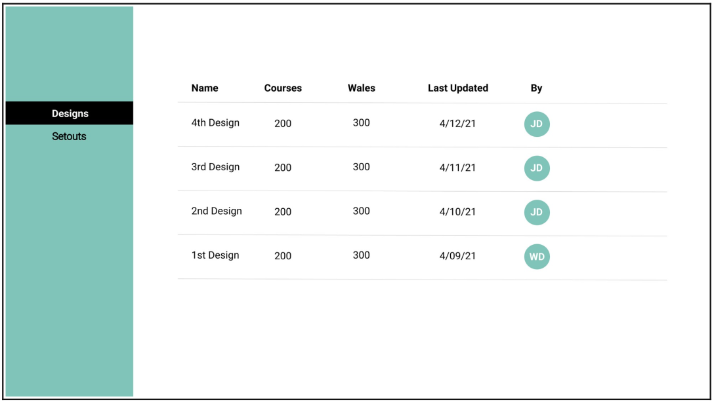
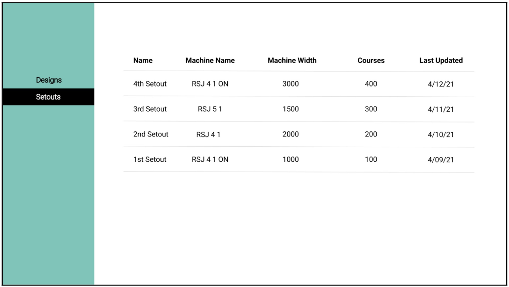

# **Designs & Setouts app**

A simple two-view app that renders a table of information from a `db.json` . It is designed using the following technology:

- React: the front end library developed by Facebook.
- TypeScript: a supersetted, typed flavour of JavaScript.
- json-server: handles the mock server to serve `db.json`.
- concurrently: handles running several scripts at a time.
- axios: handles `get` requests to the server.
- dayjs: helps quickly format dates.
- scss / sass: a better `CSS` experience.

## Visuals

The `designs` view:

The `setouts` view:

## Script to run the application

### `npm run rundevel`

## Backlog

Future improvements would include the implementation of the following features:

- 60% test coverage using JEST and React Testing Library.
- Adding a modal to edit designs or setouts by clicking on each row.
- Responsive version.
